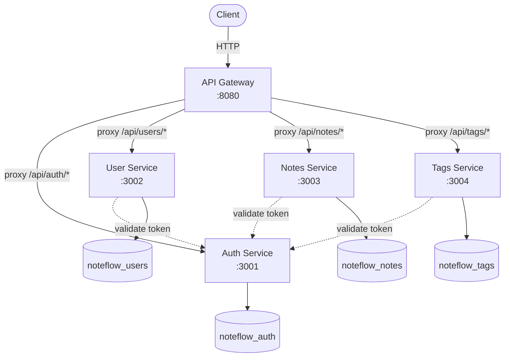
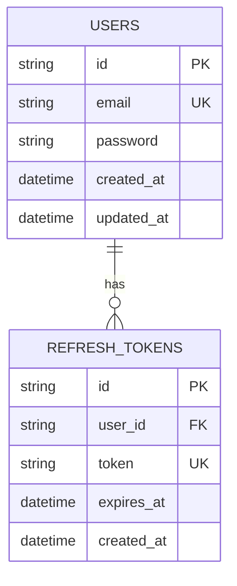
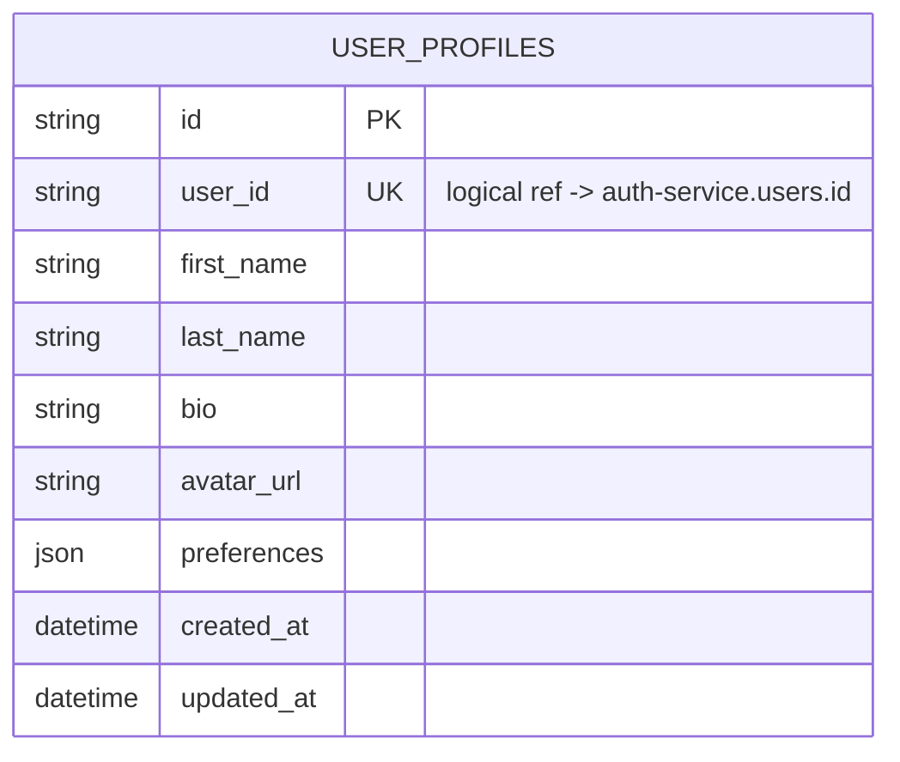
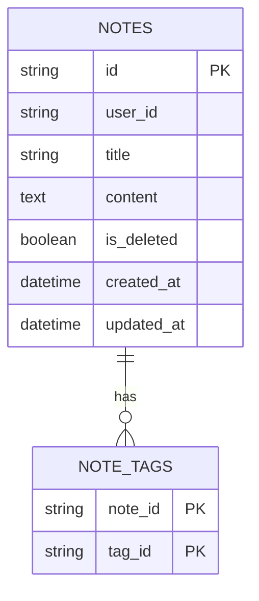
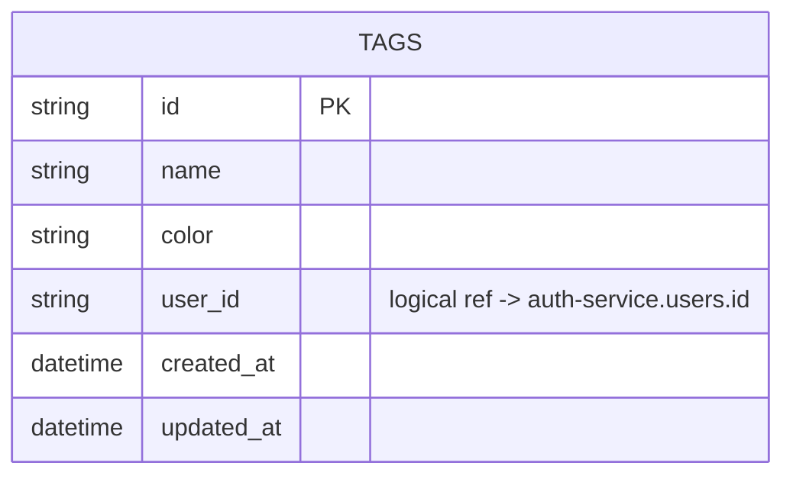
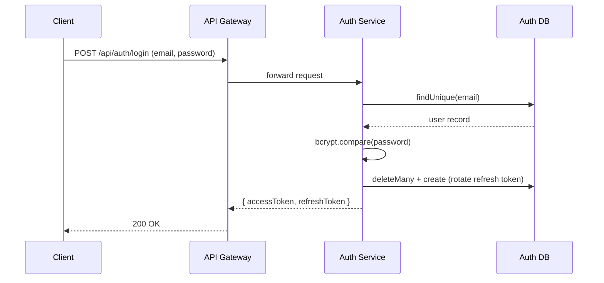
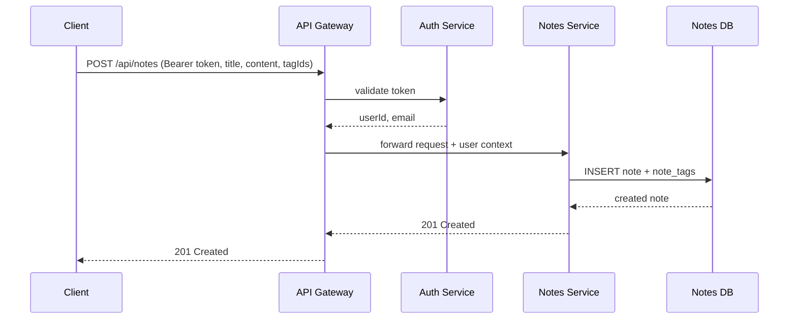
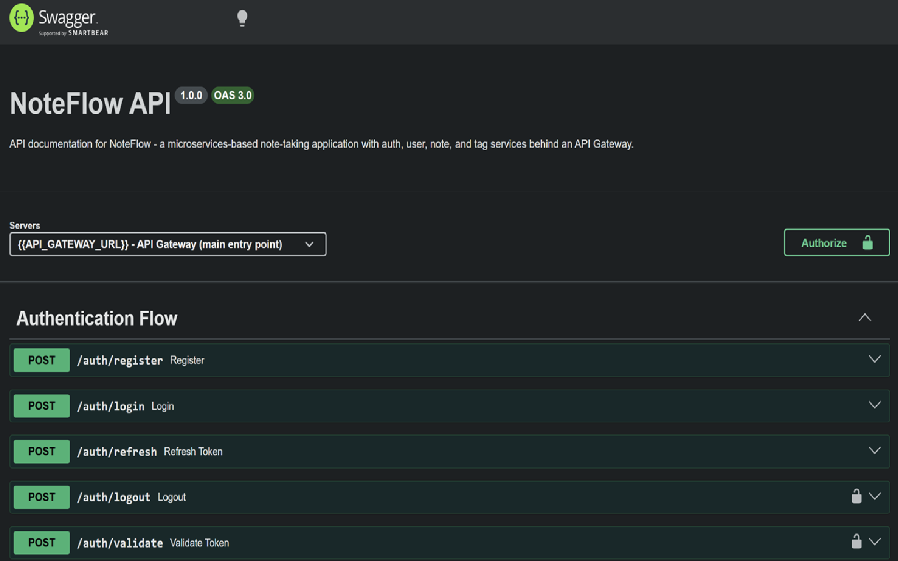
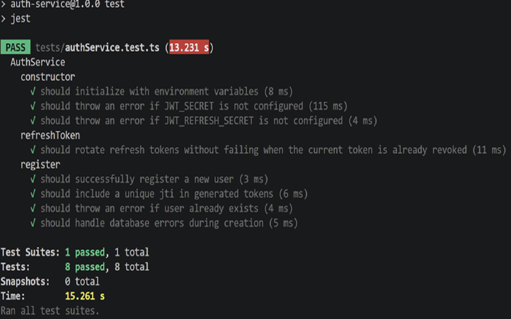
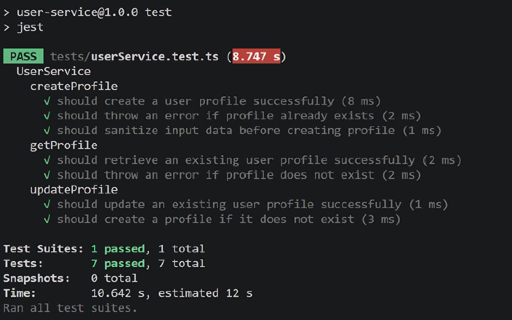

# NoteFlow

NoteFlow là ứng dụng ghi chú (note-taking) được xây dựng theo kiến trúc **microservices**, gồm các service độc lập giao tiếp qua một API Gateway trung tâm. Dự án được phát triển như một bài tập thực hành xây dựng hệ thống backend theo hướng microservices với Node.js/TypeScript.

## ✨ Features

- ✅ Đăng ký / Đăng nhập
- ✅ JWT Authentication (access token + refresh token)
- ✅ Refresh Token Rotation (thu hồi & cấp mới token sau mỗi lần refresh)
- ✅ Quản lý hồ sơ người dùng (User Profile)
- ✅ CRUD Notes
- ✅ CRUD Tags
- ✅ Soft Delete & Restore Note
- ✅ Lọc Notes theo Tag
- ✅ Swagger / OpenAPI Documentation
- ✅ Unit Tests (Jest) + Integration Tests (Supertest)
- ✅ CI/CD (GitHub Actions)

> 🔜 Search & Pagination cho Notes chưa xác nhận đã implement đầy đủ — xem mục [Roadmap](#-roadmap).

## 🛠️ Tech Stack

| Layer                                                                                                       | Technology          |
| ----------------------------------------------------------------------------------------------------------- | ------------------- |
|               | Ngôn ngữ chính      |
|                        | Runtime             |
|                    | Web framework       |
|                       | ORM                 |
|          | Database            |
|                          | Authentication      |
|                                 | Unit Testing        |
|                       | Integration Testing |
|                           | Containerization    |
|  | CI/CD               |
|                        | API Docs            |

## 🤔 Why Microservices?

- **Service isolation** — lỗi hoặc sự cố ở 1 service (VD: notes-service) không làm sập toàn bộ hệ thống auth
- **Database per service** — mỗi service sở hữu schema riêng, tránh coupling qua tầng dữ liệu, dễ đổi schema độc lập
- **Independent deployment** — có thể deploy/scale riêng từng service theo tải thực tế (VD: notes-service chịu tải cao hơn auth-service)
- **Separation of concerns** — mỗi service chỉ lo đúng 1 domain nghiệp vụ, dễ maintain và test độc lập
- **API Gateway làm điểm vào duy nhất** — ẩn chi tiết hạ tầng nội bộ khỏi client, tập trung xử lý cross-cutting concern (CORS, auth) ở 1 chỗ

## 🏗️ Architecture



Mỗi service có database riêng biệt trên cùng 1 PostgreSQL instance (port `5433` khi chạy local), khởi tạo qua `init-database.sql`. Không có foreign key thật giữa các database khác nhau — các tham chiếu như `userId` trong `Note`/`Tag` là **logical reference**, được đảm bảo tính đúng đắn ở tầng application chứ không phải DB constraint.

## 🗄️ Database Schema (ERD)

**Auth Service**



**User Service**



**Notes Service**



> **Note**
>
> - `user_id` stores the User ID from the Auth Service.
> - `tag_id` stores the Tag ID from the Tags Service.
> - Since NoteFlow follows a microservices architecture, these are **logical references** rather than database foreign keys.

**Tags Service**



## 🔄 API Flows

**Login Flow**



**Create Note Flow**



> Cơ chế xác thực trong `gatewayAuth` (Gateway tự verify JWT bằng `JWT_SECRET` dùng chung, không gọi `/auth/validate` của auth-service cho mỗi request) — cập nhật lại diagram này nếu logic thay đổi.

## 📦 Cấu trúc thư mục

```
NoteFlow/
├── api-gateway/            # Entry point duy nhất, reverse proxy tới services
│   ├── src/
│   ├── tests/              # Integration test (Supertest) — routing + auth middleware
│   ├── docs/
│   │   └── openapi.json    # OpenAPI spec, phục vụ Swagger UI
│   └── package.json
├── services/
│   ├── auth-service/       # Đăng ký, đăng nhập, JWT, refresh/logout/validate — :3001
│   ├── user-service/       # Quản lý hồ sơ người dùng — :3002
│   ├── notes-service/      # CRUD ghi chú — :3003
│   └── tags-service/       # CRUD nhãn — :3004
├── shared/                  # Types, utils, middleware dùng chung
├── .github/
│   └── workflows/
│       └── ci.yml           # GitHub Actions: test + build check
├── init-database.sql        # Khởi tạo các DB riêng cho từng service (local)
├── docker-compose.yml        # PostgreSQL + toàn bộ services (local dev)
├── render.yaml               # Render Blueprint (production deploy)
└── README.md
```

## 🚀 Bắt đầu

### Yêu cầu môi trường

- Node.js LTS gần đây (khuyến nghị 20+)
- Docker & Docker Compose
- npm

### Cài đặt

```bash
git clone <repo-url>
cd NoteFlow

cd api-gateway && npm install && cd ..
cd services/auth-service && npm install && cd ../..
cd services/user-service && npm install && cd ../..
cd services/notes-service && npm install && cd ../..
cd services/tags-service && npm install && cd ../..
```

### Biến môi trường

Mỗi service (`api-gateway`, `services/auth-service`, `services/user-service`, `services/notes-service`, `services/tags-service`) có file `.env.example` riêng. Copy và chỉnh giá trị cần thiết:

```bash
cp .env.example .env
# sau đó chỉnh sửa các giá trị (DATABASE_URL, JWT_SECRET, PORT, ...)
```

> `JWT_SECRET`/`JWT_REFRESH_SECRET` phải **giống nhau** giữa `auth-service` và các service khác cần validate token (bao gồm cả `api-gateway`).

> ⚠️ Không commit file `.env`/`.env.docker` chứa giá trị thật lên Git. Nếu secret từng bị lộ (ví dụ dán vào chat, log, hay commit nhầm), phải **rotate lại ngay** (đổi `JWT_SECRET` và database password) trên tất cả nơi liên quan.

### Chạy Database

```bash
docker compose up -d postgres
```

`init-database.sql` tự động tạo 4 database riêng (`noteflow_auth`, `noteflow_users`, `noteflow_notes`, `noteflow_tags`) khi container khởi tạo lần đầu.

### Migrate database

```bash
cd services/auth-service && npx prisma migrate deploy && cd ../..
cd services/user-service && npx prisma migrate deploy && cd ../..
cd services/notes-service && npx prisma migrate deploy && cd ../..
cd services/tags-service && npx prisma migrate deploy && cd ../..
```

### Chạy từng service (mỗi service 1 terminal riêng)

```bash
cd services/auth-service && npm run dev
cd services/user-service && npm run dev
cd services/notes-service && npm run dev
cd services/tags-service && npm run dev
cd api-gateway && npm run dev
```

Gateway chạy tại: `http://localhost:8080`

### Chạy toàn bộ bằng Docker Compose (khuyến nghị cho test local)

```bash
docker compose up --build
```

Khởi động cả 4 service + `api-gateway` + Postgres trong 1 mạng nội bộ Docker, gateway gọi các service qua tên service (`http://auth-service:3001`, ...).

## 📖 API Documentation

```
http://localhost:8080/api-docs
```

Nhóm endpoint chính: **Authentication Flow**, **User Flow**, **Notes Flow**, **Tags Flow**. Có thể test trực tiếp bằng nút **Authorize** (Bearer token) + **Try it out**, không cần Postman.

## 🧪 Testing

### Unit test (mỗi service backend)

```bash
cd services/auth-service   # hoặc user-service / notes-service / tags-service
npm test
```

Mock toàn bộ dependency ngoài (bcrypt, jsonwebtoken, Prisma). `auth-service` bao phủ:

- Đăng ký / đăng nhập: thành công & các trường hợp lỗi
- Refresh token: rotation thành công, token hết hạn, token không còn tồn tại trong DB (bảo vệ trước race-condition khi refresh token đã bị rotate)

3 service còn lại (`user-service`, `notes-service`, `tags-service`) có bộ Jest test riêng theo cùng cách tiếp cận (mock dependency ngoài, không cần database thật).

### Integration test (api-gateway)

```bash
cd api-gateway
npm test
```

Dùng `supertest` dựng lên 1 Express app giả lập trong bộ nhớ (không cần service backend hay database thật đang chạy), kiểm tra:

- Routing / `pathRewrite` proxy đúng tới từng service (`/api/auth/*`, `/api/users/*`, `/api/notes/*`, `/api/tags/*`)
- `gatewayAuth` middleware: chặn đúng request thiếu/sai token, cho qua đúng các public route (`/api/auth/register`, `/api/auth/login`, `/health`)

Đây là loại test khác với unit test ở 4 service kia — verify hành vi của gateway (routing + auth gate) độc lập với việc các service backend có đang chạy hay không.

### CI/CD

GitHub Actions ([`.github/workflows/ci.yml`](.github/workflows/ci.yml)) tự động chạy khi push hoặc mở Pull Request vào `main`:

1. **Test job** — chạy `npm test` cho `auth-service`, `user-service`, `notes-service`, `tags-service`, `api-gateway` (matrix song song, `fail-fast: false` để 1 service fail không chặn kết quả các service khác).
2. **Build job** — sau khi test job pass, build thử Docker image cho cả 5 service (`docker build -f <Dockerfile>`) để xác nhận Dockerfile không lỗi trước khi merge. Bước này chỉ verify build thành công, **không** push image lên registry hay tự động deploy.

## 📸 Screenshots

> Swagger UI



> Unit Test





## 🐳 Deploy

### Render (đang dùng cho production)

Toàn bộ hệ thống được deploy qua [Render](https://render.com) bằng **Blueprint** (`render.yaml`) — mỗi service là 1 Web Service riêng, cùng 1 Render workspace.

**Database:** dùng [Neon](https://neon.tech) (Postgres serverless), 1 project chứa 4 database riêng biệt (`noteflow_auth`, `noteflow_users`, `noteflow_notes`, `noteflow_tags`), tương tự cấu trúc local nhưng khác host.

#### ⚠️ Giới hạn quan trọng của Free tier trên Render

> Free web service trên Render **có thể gửi** request qua private network, nhưng **không thể nhận**. Vì vậy các service backend (`auth`, `user`, `notes`, `tags`) không nhận được request nội bộ nếu gateway gọi qua hostname private.

Do đó, `api-gateway` gọi sang các service khác qua **public URL** (`https://noteflow-<service>.onrender.com`), không dùng hostname nội bộ kiểu Docker Compose. Nếu nâng cấp lên gói trả phí, có thể chuyển sang dùng `fromService` + `property: hostport` trong `render.yaml` để giao tiếp qua private network, nhanh hơn và không tính bandwidth.

Hệ quả khác của free tier: mỗi service tự "ngủ" sau một khoảng thời gian không có request, khiến lần gọi đầu tiên có thể chậm hơn 50 giây (cold start) — đây là giới hạn cố hữu của nền tảng, không phải lỗi ứng dụng.

#### Các biến môi trường phải điền TAY sau khi deploy Blueprint

`render.yaml` khai báo các biến sau với `sync: false` — nghĩa là Render tạo sẵn tên biến nhưng **không tự điền giá trị**. Sau mỗi lần tạo mới service (hoặc deploy lại từ đầu), phải vào tab **Environment** của **từng service** trên Render Dashboard để nhập tay, rồi bấm **Save Changes**:

| Biến                 | Service cần set                                               | Lưu ý                                                                                                                                                                                                                                    |
| -------------------- | ------------------------------------------------------------- | ---------------------------------------------------------------------------------------------------------------------------------------------------------------------------------------------------------------------------------------- |
| `JWT_SECRET`         | **Cả 5 service** (`auth`, `user`, `notes`, `tags`, `gateway`) | Phải **giống hệt nhau tuyệt đối** ở tất cả service — đây là cơ chế các service khác verify được token do `auth-service` ký ra. Thiếu ở bất kỳ service nào sẽ gây lỗi `"Server configuration error"`.                                     |
| `JWT_REFRESH_SECRET` | Chỉ `auth-service`                                            |                                                                                                                                                                                                                                          |
| `DATABASE_URL`       | 4 service backend (`auth`, `user`, `notes`, `tags`)           | Mỗi service dùng **connection string khác nhau**, chỉ khác tên database ở cuối URL (`noteflow_auth`, `noteflow_users`, `noteflow_notes`, `noteflow_tags`). Lấy từ Neon Console → Connection Details, dùng bản **pooled** (có `-pooler`). |
| `CORS_ORIGIN`        | Tất cả service                                                | Trỏ về domain frontend thật khi có, tạm thời có thể để `*` hoặc domain dev khi test.                                                                                                                                                     |

**Dấu hiệu nhận biết thiếu biến nào:**

- Thiếu `JWT_SECRET` → response trả `"Server configuration error"` (từ gateway) hoặc lỗi tương tự ở service con.
- Thiếu/sai `DATABASE_URL` → lỗi trả nguyên văn từ Prisma, dạng `"Environment variable not found: DATABASE_URL"` hoặc `"Invalid ... invocation"`.

#### Checklist khi deploy lại từ đầu (ví dụ tạo Render account mới, hoặc xóa hết service cũ)

1. Tạo 4 database trên Neon: `noteflow_auth`, `noteflow_users`, `noteflow_notes`, `noteflow_tags` (cùng 1 project, chung host/user/password, khác tên DB).
2. Push `render.yaml` lên nhánh `main` → Render tự tạo 5 service qua Blueprint.
3. Vào từng service, điền tay `JWT_SECRET` (giống nhau ở cả 5), `DATABASE_URL` (khác nhau ở 4 service backend), `CORS_ORIGIN`.
4. Chạy `npx prisma migrate deploy` (trỏ vào từng database Neon tương ứng) từ máy local trước khi test, để tạo bảng trong database mới (database trống sẽ gây lỗi `relation does not exist`).
5. Test lại theo thứ tự: `auth` (register/login) → `user` (profile) → `tags` → `notes`, qua `api-gateway` (không gọi thẳng từng service), để xác nhận cả proxy lẫn inter-service JWT trust hoạt động đúng.

### Railway (phương án thay thế, chưa triển khai)

Có thể deploy lên [Railway](https://railway.com) — mỗi service là 1 Railway service riêng trong cùng project, chỉ `api-gateway` bật Public Networking, các service còn lại giữ private, giao tiếp qua mạng nội bộ Railway (Railway không có giới hạn free-tier-chặn-nhận-private-traffic giống Render, cần xác nhận lại nếu chọn hướng này).

## 🗺️ Roadmap

- [x] JWT Authentication + Refresh Rotation
- [x] CRUD Notes / Tags
- [x] Swagger / OpenAPI
- [x] Unit Test
- [x] Pagination
- [x] Deploy production (Render + Neon)
- [x] Docker hóa toàn bộ services
- [x] Integration Test (api-gateway — routing + auth middleware, Supertest)
- [x] CI/CD (GitHub Actions — test matrix + Docker build check)
- [ ] Search Notes
- [ ] Redis Cache

## 🔮 Future Improvements

- Redis cho caching / session store
- Message queue (RabbitMQ) cho giao tiếp bất đồng bộ giữa service
- Distributed tracing (VD: OpenTelemetry) để debug request xuyên nhiều service
- Monitoring: Prometheus + Grafana
- Chuyển gateway ↔ services sang private network khi nâng cấp Render lên gói trả phí
- Tự động deploy (CD) từ CI sau khi build-check pass, thay vì chỉ dừng ở bước verify

## 📄 License

MIT
