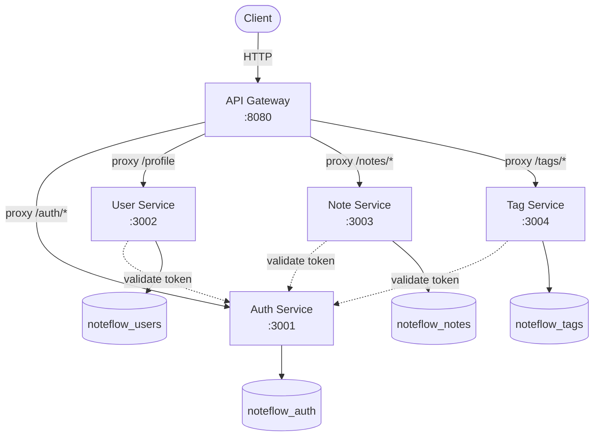
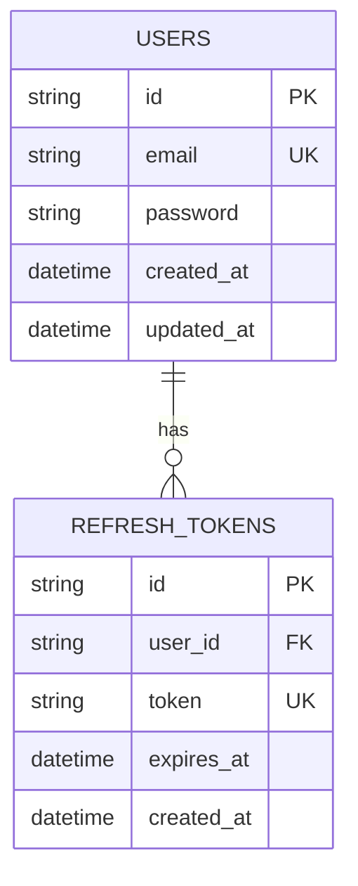
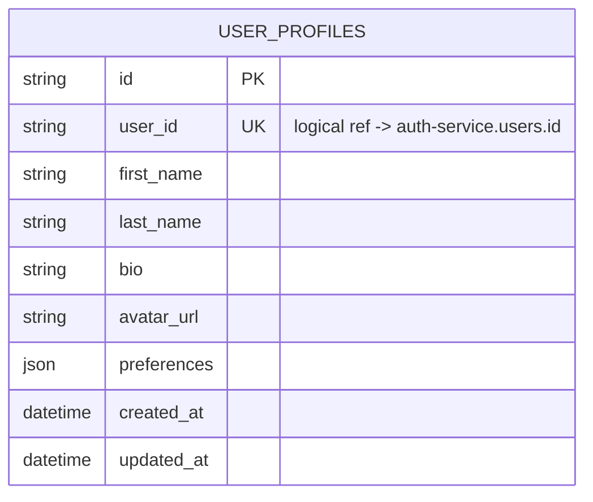
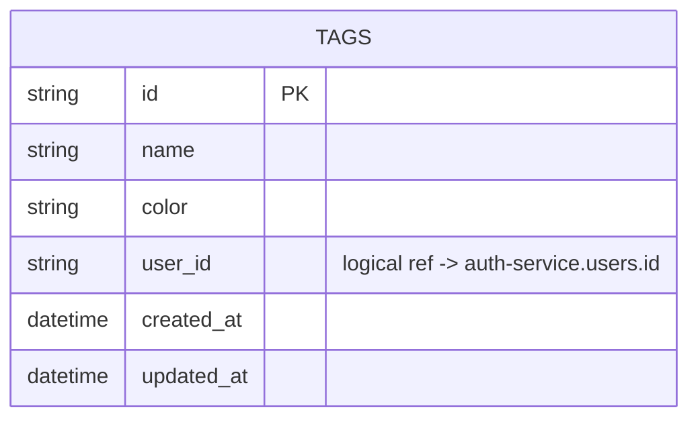
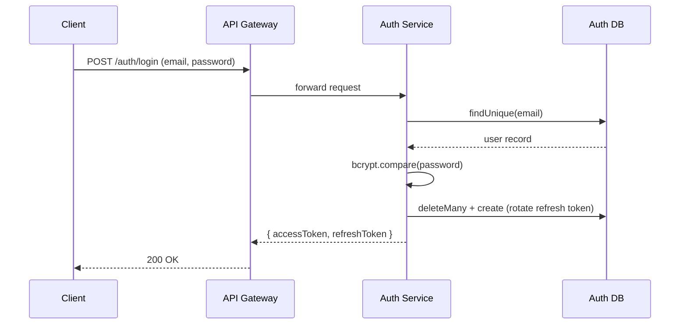
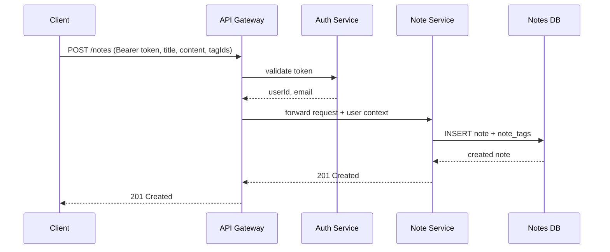

# NoteFlow

NoteFlow là ứng dụng ghi chú (note-taking) được xây dựng theo kiến trúc **microservices**, gồm các service độc lập giao tiếp qua một API Gateway trung tâm. Dự án được phát triển như một bài tập thực hành xây dựng hệ thống backend theo hướng microservices với Node.js/TypeScript.

## ✨ Features

- ✅ Đăng ký / Đăng nhập
- ✅ JWT Authentication (access token + refresh token)
- ✅ Refresh Token Rotation (thu hồi & cấp mới token sau mỗi lần refresh)
- ✅ Quản lý hồ sơ người dùng (User Profile)
- ✅ CRUD Notes
- ✅ CRUD Tags
- ✅ Soft Delete & Restore Note
- ✅ Lọc Notes theo Tag
- ✅ Swagger / OpenAPI Documentation
- ✅ Unit Tests (Jest)

> 🔜 Search & Pagination cho Notes chưa xác nhận đã implement đầy đủ — xem mục [Roadmap](#-roadmap).

## 🛠️ Tech Stack

| Layer                                                                                               | Technology            |
| --------------------------------------------------------------------------------------------------- | --------------------- |
|       | Ngôn ngữ chính        |
|                | Runtime               |
|            | Web framework         |
|               | ORM                   |
|  | Database              |
|                  | Authentication        |
|                         | Testing               |
|                   | Containerization (DB) |
|                | API Docs              |

## 🤔 Why Microservices?

- **Service isolation** — lỗi hoặc sự cố ở 1 service (VD: note-service) không làm sập toàn bộ hệ thống auth
- **Database per service** — mỗi service sở hữu schema riêng, tránh coupling qua tầng dữ liệu, dễ đổi schema độc lập
- **Independent deployment** — có thể deploy/scale riêng từng service theo tải thực tế (VD: note-service chịu tải cao hơn auth-service)
- **Separation of concerns** — mỗi service chỉ lo đúng 1 domain nghiệp vụ, dễ maintain và test độc lập
- **API Gateway làm điểm vào duy nhất** — ẩn chi tiết hạ tầng nội bộ khỏi client, tập trung xử lý cross-cutting concern (CORS, auth) ở 1 chỗ

## 🏗️ Architecture



Mỗi service có database riêng biệt trên cùng 1 PostgreSQL instance (port `5433`), khởi tạo qua `init-database.sql`. Không có foreign key thật giữa các database khác nhau — các tham chiếu như `userId` trong `Note`/`Tag` là **logical reference**, được đảm bảo tính đúng đắn ở tầng application chứ không phải DB constraint.

## 🗄️ Database Schema (ERD)

**Auth Service**



**User Service**



**Note Service**

```mermaid
erDiagram
    NOTES ||--o{ NOTE_TAGS : has
    NOTES {
        string id PK
        string user_id "logical ref -> auth-service.users.id"
        string title
        text content
        boolean is_deleted
        datetime created_at
        datetime updated_at
    }
    NOTE_TAGS {
        string note_id PK_FK
        string tag_id PK "logical ref -> tag-service.tags.id"
    }
```

**Tag Service**



## 🔄 API Flows

**Login Flow**



**Create Note Flow**



> Cơ chế xác thực trong `gatewayAuth` (Gateway có tự verify JWT hay gọi `/auth/validate` của auth-service) được suy ra từ tên route và comment trong code, chưa được xác nhận trực tiếp từ file middleware — cập nhật lại diagram này nếu khác thực tế.

## 📦 Cấu trúc thư mục

```
NoteFlow/
├── api-gateway/            # Entry point duy nhất, reverse proxy tới services
│   ├── src/
│   ├── docs/
│   │   └── openapi.json    # OpenAPI spec, phục vụ Swagger UI
│   └── package.json
├── services/
│   ├── auth-service/       # Đăng ký, đăng nhập, JWT, refresh/logout/validate — :3001
│   ├── user-service/       # Quản lý hồ sơ người dùng — :3002
│   ├── note-service/       # CRUD ghi chú — :3003
│   └── tag-service/        # CRUD nhãn — :3004
├── shared/                  # Types, utils, middleware dùng chung
├── init-database.sql        # Khởi tạo các DB riêng cho từng service
├── docker-compose.yml        # PostgreSQL container
└── README.md
```

## 🚀 Bắt đầu

### Yêu cầu môi trường

- Node.js LTS gần đây (khuyến nghị 20+)
- Docker & Docker Compose
- npm

### Cài đặt

```bash
git clone <repo-url>
cd NoteFlow

cd api-gateway && npm install && cd ..
cd services/auth-service && npm install && cd ../..
cd services/user-service && npm install && cd ../..
cd services/note-service && npm install && cd ../..
cd services/tag-service && npm install && cd ../..
```

### Biến môi trường

Mỗi service (`api-gateway`, `services/auth-service`, `services/user-service`, `services/note-service`, `services/tag-service`) có file `.env.example` riêng. Copy và chỉnh giá trị cần thiết:

```bash
cp .env.example .env
# sau đó chỉnh sửa các giá trị (DATABASE_URL, JWT_SECRET, PORT, ...)
```

> `JWT_SECRET`/`JWT_REFRESH_SECRET` phải **giống nhau** giữa `auth-service` và các service khác cần validate token.

### Chạy Database

```bash
docker compose up -d postgres
```

`init-database.sql` tự động tạo 4 database riêng (`noteflow_auth`, `noteflow_users`, `noteflow_notes`, `noteflow_tags`) khi container khởi tạo lần đầu.

### Migrate database

```bash
cd services/auth-service && npx prisma migrate deploy && cd ../..
cd services/user-service && npx prisma migrate deploy && cd ../..
cd services/note-service && npx prisma migrate deploy && cd ../..
cd services/tag-service && npx prisma migrate deploy && cd ../..
```

### Chạy từng service (mỗi service 1 terminal riêng)

```bash
cd services/auth-service && npm run dev
cd services/user-service && npm run dev
cd services/note-service && npm run dev
cd services/tag-service && npm run dev
cd api-gateway && npm run dev
```

Gateway chạy tại: `http://localhost:8080`

## 📖 API Documentation

```
http://localhost:8080/api-docs
```

Nhóm endpoint chính: **Authentication Flow**, **User Flow**, **Notes Flow**, **Tags Flow**. Có thể test trực tiếp bằng nút **Authorize** (Bearer token) + **Try it out**, không cần Postman.

## 🧪 Testing

```bash
cd services/auth-service
npm test
```

Test hiện tại (unit test, mock toàn bộ dependency ngoài — bcrypt, jsonwebtoken, Prisma) bao phủ `AuthService`:

- Đăng ký / đăng nhập: thành công & các trường hợp lỗi
- Refresh token: rotation thành công, token hết hạn, token không còn tồn tại trong DB (bảo vệ trước race-condition khi refresh token đã bị rotate)

> Chưa có integration test (test qua HTTP thật, với DB thật).

## 📸 Screenshots

> Thêm ảnh chụp màn hình thực tế vào đây khi có (Swagger UI, ví dụ request/response) — ảnh giúp README trực quan hơn nhiều so với chỉ có text.

## 🐳 Deploy

Có thể deploy lên [Railway](https://railway.com) — mỗi service là 1 Railway service riêng trong cùng project, chỉ `api-gateway` bật Public Networking, các service còn lại giữ private, giao tiếp qua mạng nội bộ Railway.

## 🗺️ Roadmap

- [x] JWT Authentication + Refresh Rotation
- [x] CRUD Notes / Tags
- [x] Swagger / OpenAPI
- [x] Unit Test
- [ ] Search Notes
- [ ] Pagination
- [ ] Integration Test
- [ ] Redis Cache
- [ ] Docker hóa toàn bộ services (hiện chỉ Postgres)
- [ ] CI/CD

## 🔮 Future Improvements

- Redis cho caching / session store
- Message queue (RabbitMQ) cho giao tiếp bất đồng bộ giữa service
- Distributed tracing (VD: OpenTelemetry) để debug request xuyên nhiều service
- Monitoring: Prometheus + Grafana

## 📄 License

ISC
